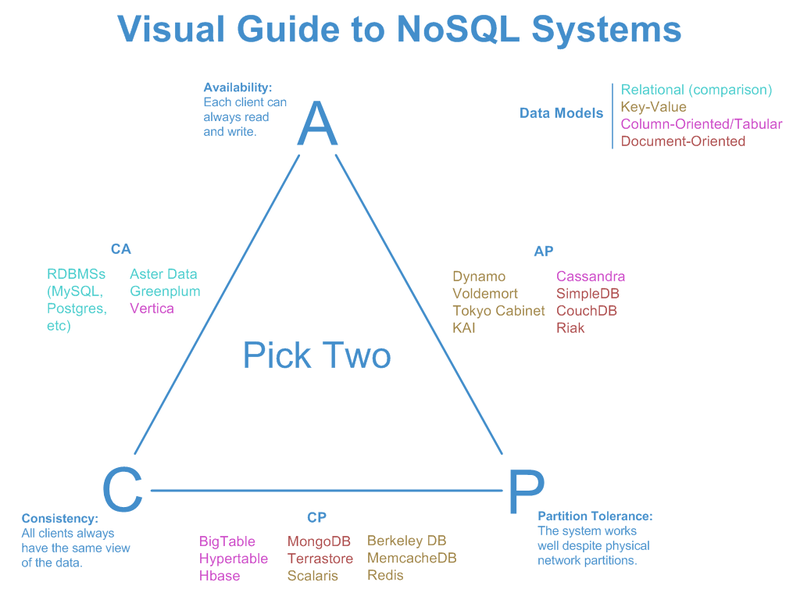
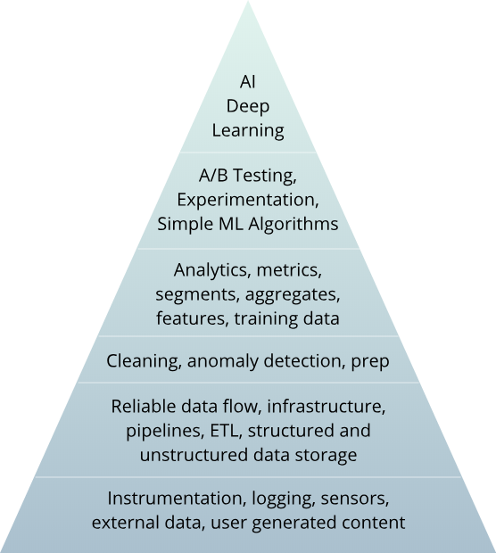

# Big Data introduction

Data is the foundation of modern business innovation. Organizations generate data continuously—from applications, sensors, user interactions, and external systems. The challenge is not just storage, but designing scalable, resilient architectures that can ingest, process, and serve data in real time and batch.

Today's data platforms are built on **cloud-native principles**: containerization, Kubernetes orchestration, and composable microservices. Rather than monolithic data warehouses or on-premises clusters, modern organizations deploy distributed systems on Kubernetes that combine real-time streaming (Kafka), distributed computation (Spark), cloud storage (object stores), and SQL-federated query engines (Trino).

The **medallion data lakehouse architecture** unifies the flexibility of data lakes (storing raw, diverse data) with the governance and performance of warehouses (curated, business-ready data), all backed by cloud-native storage and open table formats (Apache Iceberg, Delta Lake).

## History of data

**70's - 00's: RDBMS**

- Data created and used only by technical people (through programming languages)
- Non human readable
- Strongly typed => structured data

**2000-2005: Internet rises**

- Access to data
- Readable data => semi-structured data (HTML), unstructured data (text, images, sound)
- Beginning of NoSQL

**2005-today: Social networks**, customer 360

- Data explosion
- Data created and used by everyone
- End of Moore law

## Who needs Big Data?

- Not only GAFAM
- For "normal" enterprises (where data is not at the core of the business)
  - Extract value from their data
  - Build "Data Lakes": gather data from all around the company (+ outside)

## Information Systems

What is an Information System (IS)?

- Collect data
- Process it
- Store it
- Distribute it

## Distributed systems

A distributed system is a group of computers that appear as a unique and coherent system to the end user.

- Advantages:

  - Scalability
  - Availability
  - Flexibility

- Disadvantages:

  - Harder to architecture
  - Harder to use
  - Harder to maintain

## The CAP Theorem

- **Consistency**: For one given query, all the nodes return the most recent value or an error
- **Availability**: Every query receives a fast response, without guarantee that this is the latest value
- **Partition tolerance**: The system continues to work even if some nodes are disconnected
- No storage system can ensure more than 2 of those properties at the same time
- [Learn more](https://mwhittaker.github.io/blog/an_illustrated_proof_of_the_cap_theorem/)



## Horizontal vs. vertical scaling

- **Vertical scaling:** increase the size of the servers = more RAM, more powerful CPUs, more disk space, etc.
- **Horizontal scaling:** increase the number of server instead of their size. Works for distributed systems.

## Data structure

- **Structured:** RDBMS tables, Excel sheet, CSV
  ```csv
  firstname,lastname,address
  Dark,Vador,lava planet of Mustafar
  ```
- **Semi-structured:** JSON, XML

  ```json
  [
    {
      "firstname": "Dark",
      "lastname": "Vador",
      "alias": "Anakin Skywalker"
    },
    {
      "firstname": "Anakin",
      "lastname": "Skywalker",
      "spouse": "Padmé Amidala"
    }
  ]
  ```

- **Unstructured:** plain text, images, sound

## The 3 Vs

- Volume
- Velocity
- Variety
- ... and friends

Modern data platforms must handle the classic "3 Vs" challenges, now solved through cloud-native architecture. Modern data platforms recognize additional challenges, sometimes called the 5 Vs, 7 Vs, or more, depending on the context.

### Volume

- Challenge: Petabyte-scale datasets cannot fit on a single machine or traditional database.
- Cloud-Native Solution:
  - Horizontal scaling on Kubernetes: add more worker nodes
  - Object storage (S3-compatible) scales to unlimited capacity
  - Distributed processing (Spark) parallelizes across nodes

### Velocity

- Challenge: Data arrives continuously—from IoT sensors, applications, databases. Real-time insights are critical.
- Cloud-Native Solution:
  - Event streaming (Kafka) ingests in real-time
  - Spark Structured Streaming processes unbounded data
  - Low-latency query engines (Trino, DuckDB) serve dashboards instantly

### Variety

- Challenge: Data is structured (databases), semi-structured (JSON, logs), and unstructured (images, text).
- Cloud-Native Solution:
  - Object storage accommodates all formats
  - Open table formats (Iceberg) handle schema evolution
  - Medallion architecture cleanses and standardizes raw diversity in Bronze → Silver layers
  - Query engines read multiple formats and sources seamlessly

## Medallion Data Lakehouse Architecture

The medallion architecture organizes data into three layers, each serving a distinct purpose:

- Bronze Layer: Raw data ingestion
- Silver Layer: Cleaned, deduplicated, conformable data
- Gold Layer: Business-ready, curated analytics

## Modern Data Platform Roles

The data platform hierarchy reflects the infrastructure-first approach: before analysis, you need reliable, scalable systems.

- Data Engineer
  Designs, builds, and optimizes cloud-native data pipelines and infrastructure.
  - Skills: Kubernetes, Docker, Spark, Kafka, NiFi/Hop/Airflow, dbt, SQL, Python
  - Responsibilities:
    - Data ingestion pipelines (CDC, ETL/ELT)
    - Cloud storage architecture (object stores, Ceph)
    - Real-time streaming (Kafka topics, event schemas)
    - Data orchestration (schedule, monitor, scale)
    - Security & governance (RBAC, data lineage)

- Data Scientist / Machine Learning Engineer
  Applies ML models and advanced analytics (requires clean data from data engineers).
  - Model training and deployment
  - Feature engineering
  - Python / R

- Data Analyst
  Interprets data and creates dashboards/insights.
  - SQL querying and visualization
  - Business intelligence and reporting
  - Statistical analysis

- Data Architect
  Creates and maintains the overall structure and strategy for data management, ensuring data systems are scalable, secure, and aligned with business goals.
  - Medallion/lakehouse architecture design
  - Tool selection and deployment
  - Data governance and quality frameworks
  - Observability
  - Cost optimization and scaling strategies

- Analytics Engineer
  Bridges the gap between raw data infrastructure and business analysis by cleaning, modeling, and transforming data for end-users
  - dbt modeling and testing
  - Silver/Gold layer transformations
  - Data quality ownership
  - SQL-based analytics and reporting

<figure style="text-align: center">
  
  <figcaption>DS hierarchy</figcaption>
</figure>

Key insight: All data work depends on the data engineer's infrastructure. You are building the foundation.

## Resources & Further Reading

### Big data

- [What Is Big Data?](https://www.oracle.com/big-data/what-is-big-data/)

### Cloud-Native & Kubernetes

- [What is Cloud Native?](https://aws.amazon.com/what-is/cloud-native/)
- [Kubernetes Official Documentation](https://kubernetes.io/docs/)

### Data Architecture

- [Medallion Architecture (Databricks)](https://www.databricks.com/blog/what-is-medallion-architecture)
- [What is a Data Lakehouse?](https://www.databricks.com/blog/what-is-data-lakehouse)

---

_The content of this document, including all text, images, and associated materials, is the exclusive property of Adaltas and is protected by applicable copyright laws. Unauthorized distribution, reproduction, or sharing of this content, in whole or in part, is strictly prohibited without the express written consent of the author(s). Any violation of this restriction may result in legal action and the imposition of penalties as prescribed by law._
