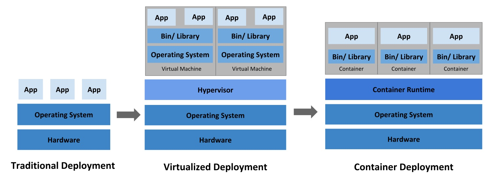
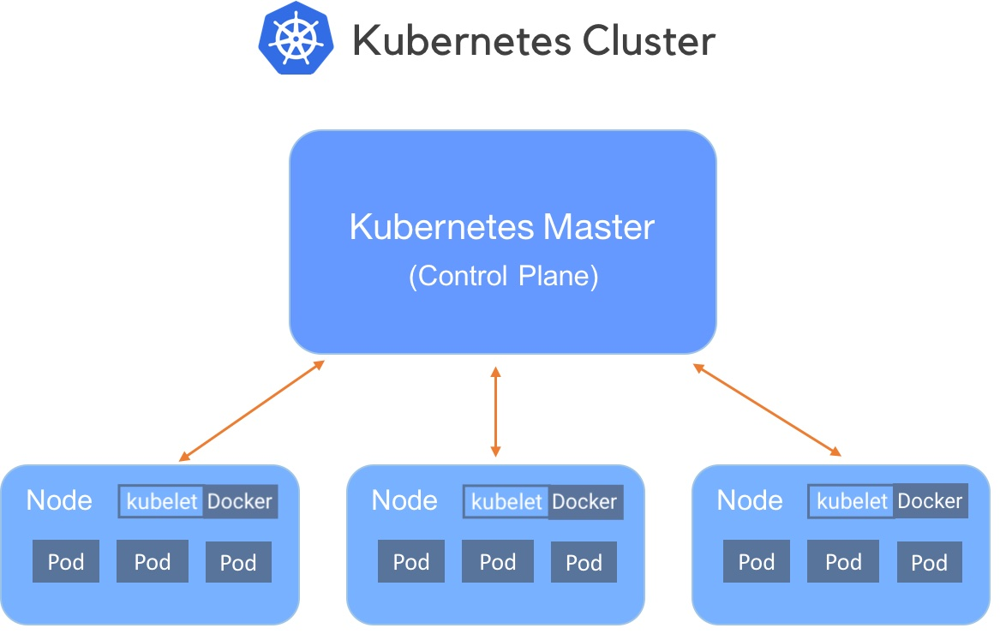

# Containerization and Kubernetes

Containers offer a logical packaging mechanism in which applications can be abstracted from the environment in which they actually run. This decoupling allows container-based applications to be deployed consistently, regardless of whether the target environment is a private data center, the public cloud, or even a developer’s personal laptop. Containerization provides a clean separation of concerns, as developers focus on their application logic and dependencies, while IT operations teams can focus on deployment and management without bothering with application details such as specific software versions and configurations specific to the app.

The portability and reproducibility of a containerized process mean we have an opportunity to move and scale our containerized applications across clouds and data centers. Furthermore, as we scale our applications up, we’ll want some tools to help automate the maintenance of those applications, able to replace failed containers automatically and manage the rollout of updates and reconfigurations of those containers during their lifecycle. Tools to manage, scale, and maintain containerized applications are called **orchestrators**.

## The problems for developers

- Consistent environment  
  Ability to create predictable environments that are isolated from other applications.
- Run anywhere  
  Ability to run virtually anywhere: on Linux, Windows, and Mac operating systems; on virtual machines or bare metal; on a developer’s machine or in data centers on-premises; in the public cloud.
- Isolation
  Ability to virtualize CPU, memory, storage, and network resources at the OS level, providing developers with a sandboxed view of the OS logically isolated from other applications.

## Container definition

- Standardized unit of software that allows developers to isolate their application from its environment.
- Packages code and all its dependencies, so that the application runs quickly and reliably from one computing environment to another.
- Container platforms:
  - **Docker**
  - LXC (Linux Containers)
  - rkt (CoreOS Rocket)
  - podman
  - etc..

## Container vs Virtual Machines vs Bare metal



## Requirements for Container-Based applications

- Manage containers
- Ensure that there is no downtime (SLA requirement)

## Container orchestration services

- Deployment
- Management
- Scaling
- Networking

## Containers complexity

- Provisioning and deployment
- Configuration and scheduling
- Resource allocation
- Container availability
- Scaling or removing containers based on balancing workloads across your infrastructure
- Load balancing and traffic routing
- Monitoring container health
- Configuring applications based on the container in which they will run
- Keeping interactions between containers secure

## Container orchestration tools

- **Kubernetes**
- Docker Compose (has limited functionality)
- Docker Swarm
- LXD/Incus

## Cloud-native and Kubernetes

Cloud-native is a modern approach for building systems that leverage cloud infrastructure. The principles of cloud-native includes containerization, microservices, declarative infrastructure, auto-scaling, resilience, etc.

Kubernetes, one specific implementation of cloud-native orchestration, is an open-source system for automating deployment, scaling, and management of containerized applications.

## Kubernetes features

- Automated rollouts and rollbacks
- Service health monitoring
- Automatic scaling of services
- Declarative management
- Deploy anywhere, including hybrid deployments
- Storage orchestration

## Kubernetes cluster

- Master - coordinates the cluster
- Nodes - workers that run applications



## Modern Cloud-native Data Platform Stack Examples

- Orchestration Layer: Kubernetes
  - Container runtime and pod scheduling
  - CustomResourceDefinitions (CRDs) for domain-specific operators
  - RBAC, networking policies, secrets management

- Storage Layer: Object Storage (S3-compatible) (block or FS are options too)
  - Cloud provider services (Azure Blob, AWS S3, GCP Cloud Storage)
  - On-premises: Ceph with RADOS Gateway (RGW)
  - Immutable, cost-effective, globally accessible

- Computation Layer: Distributed Processing
  - Batch: Apache Spark (via Spark Operator on Kubernetes)
  - Real-time Streaming: Apache Kafka + Spark Structured Streaming
  - Data Orchestration: Apache NiFi / Apache Hop for data pipelines

- Lakehouse/Catalog Layer: Open Table Formats & Query Federation
  - Table Format: Apache Iceberg (ACID, time travel, schema evolution)
  - Catalog: Apache Polaris (REST API-driven metadata management)
  - Query Engines: Trino, Spark SQL, DuckDB (federated multi-engine access)

- Data Transformation & Analytics: dbt (Data Build Tool)
  - Medallion architecture implementation (Bronze → Silver → Gold)
  - Version control, documentation, testing for analytics code

- Change Data Capture (CDC): Debezium
  - Stream database changes in real-time via Kafka

## Kubernetes objects definitions

**Kubernetes objects** - persistent entities in the Kubernetes system. Kubernetes uses these entities to represent the state of the cluster:

- Running containers
- Available resources
- Policies

**Objects:**

- Pod
- Deployment
- Service
- ...

[Read more about Kubernetes objects](https://kubernetes.io/docs/concepts/overview/working-with-objects/kubernetes-objects/)

### Kubernetes Objects: Pods

**Pods** are (an abstraction of containers):

- the smallest deployable units of computing
- group of one or more containers (tightly coupled)
- could be _replicated_ (scaled horizontally)
- ephemeral, disposable entities (The Pod remains on the node until the Pod finishes execution, the Pod object is deleted, the Pod is evicted for lack of resources, or the node fails.)

Example of `.yaml` (or `.yml`) file:

```yaml
apiVersion: v1
kind: Pod
metadata:
  name: redis
spec:
  containers:
    - name: redis
      image: redis
      volumeMounts:
        - name: redis-storage
          mountPath: /data/redis
  volumes:
    - name: redis-storage
      emptyDir: {}
```

### Kubernetes Objects: Deployment

Provides declarative updates for Pods (an abstraction of Pods).

You describe a **desired state** in a Deployment, and the Deployment Controller changes the actual state to the desired state.

Example:

```yaml
apiVersion: apps/v1
kind: Deployment
metadata:
  name: nginx-deployment
spec:
  selector:
    matchLabels:
      app: nginx
  replicas: 2 # tells deployment to run 2 pods matching the template
  template:
    metadata:
      labels:
        app: nginx
    spec:
      containers:
        - name: nginx
          image: nginx:1.14.2
          ports:
            - containerPort: 80
```

[Read more](https://kubernetes.io/docs/concepts/workloads/pods/)

### Kubernetes Objects: Service

An abstract (abstraction of network) way to expose an application running on a set of Pods **as a network service**.

With Kubernetes you don't need to modify your application to use an unfamiliar service discovery mechanism. Kubernetes gives Pods their own IP addresses and a single DNS name for a set of Pods and can load-balance across them.

Example:

```yaml
apiVersion: v1
kind: Service
metadata:
  name: my-service
spec:
  selector:
    app: nginx
  ports:
    - protocol: TCP
      port: 80
      targetPort: 9376
```

## Kubernetes object management

| Management technique             | Operates on          | Recommended environment |
| -------------------------------- | -------------------- | ----------------------- |
| Imperative commands              | Live objects         | Development projects    |
| Imperative object configuration  | Individual files     | Production projects     |
| Declarative object configuration | Directories of files | Production projects     |

**Examples:**

Imperative commands:

```
kubectl create deployment nginx --image nginx
```

Imperative object configuration:

```
kubectl create -f nginx.yaml
kubectl delete -f nginx.yaml -f redis.yaml
```

Declarative object configuration:

```
kubectl apply -f path/to/folder/
```

[Read more](https://kubernetes.io/docs/concepts/overview/working-with-objects/object-management/)

## Resource configuration organization

```
project/k8s/development
├── deployment
│   └── my-deployment.yaml
└── service
    └── my-service.yaml
```

[Read more about managing resources](https://kubernetes.io/docs/concepts/cluster-administration/manage-deployment/)

## Pod storage

Kubernetes volumes:

- similar to Docker volumes
- many types supported

Volume types:

- `emptyDir` - ephemeral (exist as long as Pod is running on that Node)
- `hostPath` - mounts a directory from the Node
- ... many of other types

[Read more](https://kubernetes.io/docs/concepts/storage/volumes/)

## Networking

Communications types:

1. Highly-coupled container-to-container  
   Solved by Pods and `localhost`
2. Pod-to-Pod  
   Pods on a node can communicate with all pods on all nodes
3. Pod-to-Service  
   Covered by Services
4. External-to-Service  
   Covered by Ingress

[Read more](https://kubernetes.io/docs/concepts/cluster-administration/networking/)

## minikube

- Tool that makes it easy to run Kubernetes locally
- Runs a single-node Kubernetes cluster inside a Virtual Machine (VM)
- Perfect to get started with Kubernetes or develop locally

## References

- [Kubernetes concepts](https://kubernetes.io/docs/concepts/)
- [Katakoda - Learn Kubernetes using Interactive Browser-Based Scenarios](https://www.katacoda.com/courses/kubernetes)

---

_The content of this document, including all text, images, and associated materials, is the exclusive property of Adaltas and is protected by applicable copyright laws. Unauthorized distribution, reproduction, or sharing of this content, in whole or in part, is strictly prohibited without the express written consent of the author(s). Any violation of this restriction may result in legal action and the imposition of penalties as prescribed by law._
