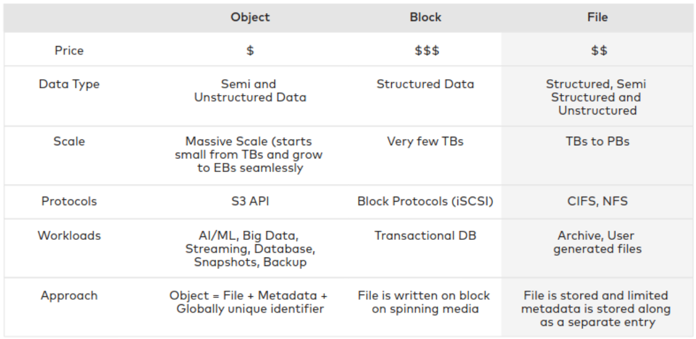
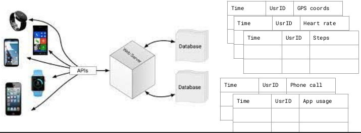
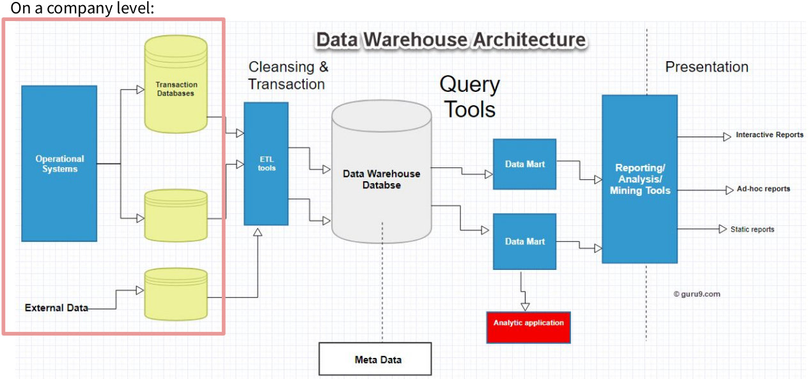

# Cloud Storage

## CNCF Cloud Native Definition v1.0

> Cloud native practices empower organizations to develop, build, and deploy workloads in computing environments (public, private, hybrid cloud) to meet their organizational needs at scale in a programmatic and repeatable manner. It is characterized by loosely coupled systems that interoperate in a manner that is secure, resilient, manageable, sustainable, and observable.

> Cloud native technologies and architectures typically consist of some combination of containers, service meshes, multi-tenancy, microservices, immutable infrastructure, serverless, and declarative APIs — this list is non-exhaustive.

**Note**: The definition is not related to cloud per-se, but to application architecture.

[Reference](https://github.com/cncf/toc/blob/main/DEFINITION.md)

## Cloud storage formats

Storage types, which defines how bytes are stored and accessed, include block, object, and file system storage. The infrastructure layer acts as a backbone of the cloud architecture and allows the data architect and data engineer implement application and computing layers on top of this storage layer.

### Comparison of different cloud storage formats

### AWS storage offer

### Azure storage offer

## Cloud native storage

- Requirements:
  - S3 compatible API
  - built for Kubernetes
- Cloud native storage is **object storage**
  - can handle huge amounts of data
  - affordable
  - sufficiently fast for the applications
  - distributed
  - resilient
  - highly available
- Storage and compute are **decoupled** (we can scale them independently)

## Object storage

### What is an object?

Components:

- **data**:
  - structured data: database snapshots
  - unstructured: videos, audio files
  - semi-structured: logs
  - max size for individual object (5 TB S3 bucket object, 200 TB Azure blob storage)
  - binary objects (not the same as blocks)
- **network address**:
  - Example: http://s3amazonaws.com/<bucket-name>/<object-name> (for publicly available objects on AWS)
- **metadata**:
  - user that created it, last access…
  - checksum
  - lifecycle policy (expiration date)

### How is an object stored?

- Objects are stored as **key-value pairs**
  - key: network address
  - value: the data
- They are **immutable**

[Addtional reading: Azure Blob Storage vs AWS S3 – Which is Better? (Pros and Cons)](https://cloudinfrastructureservices.co.uk/azure-blob-storage-vs-aws-s3-which-is-better/)

## Virtualized storage And Software defined storage

- **Virtualized** storage:
  - decoupling the hardware and capacity
  - we can join different storage devices into one big storage pool
  - the resources will be shared among users/applications
- **Software-defined** storage:
  - separates the hardware from functional aspects of the storage
  - security
  - identity and access management
  - predicate pushdown
  - data fault-tolerance
  - could implement objects, blocks and files
  - proprietary and open-source projects

## Replication vs. erasure-code storage

### Replication

In traditional HDFS [data replication](https://hadoop.apache.org/docs/r1.2.1/hdfs_design.html#Data+Replication) pattern, the data is stored into multiple full copies across different nodes. The default is 3 replicas (size = 3), tolerating the loss of 2 copies before data is at risk.

- Overhead: with 3x replication, storing 1 TB of data consumes 3 TB of raw capacity, which means 200% overhead.
- Performance: reads can be served from any replica, and writes are straightforward (write to primary, primary replicates to secondaries) — no computation needed to reconstruct data, so recovery and I/O are fast.
- Best for: latency-sensitive workloads where speed matters more than storage efficiency.

### Erasure-coded

[Erasure-coded pools](https://docs.ceph.com/en/reef/rados/operations/erasure-code/) offer an alternative to traditional replication for ensuring data durability. This technique splits data into multiple fragments - both data blocks (K) and parity blocks (M) - allowing reconstruction of information even when some storage devices fail. Erasure coding is more space-efficient than replication at scale but comes with performance implications. Remember that erasure-code profiles become immutable once pools are created.

In Ceph's implementation, the default configuration uses two data chunks and two coding chunks (K=2, M=2), providing a balance of redundancy and efficiency. For minimal overhead, you can configure pools with two data chunks and just one coding chunk (K=2, M=1). The M value directly determines your cluster's fault tolerance - how many OSDs can fail without compromising data availability.

Best for large, mostly cold/append-only objects (RGW/S3 buckets, backups, archival data) where capacity efficiency matters more than raw IOPS.

[Reference](https://www.datacore.com/software-defined-storage/)

## Data storage architecture

- Data Warehouse
- Data Lake
- Data Lakehouse

## Databases

- collections of tables
- data comes from multiple sources
- goal: to analyze containing data
  - **Can we do it directly in the database?**

### OLTP vs. OLAP

[Reference](https://diffzi.com/oltp-vs-olap/)

#### Row-oriented vs. columnar storage

#### ACID properties

[Reference](https://www.bmc.com/blogs/acid-atomic-consistent-isolated-durable/)

#### Imagine this company-wise

- Many departments collect or buy the data
- Management would like to get insights from these data as a whole
- But:
  - The data might be (or, probably is) messy
  - Different bits of information can be found in different tables
- Does every department manage the collection, cleaning and maintenance by themselves?

## Data warehouse

Data warehouse characteristics:

- **Subject-oriented**:
  - compiles subject-related data (e.g. sales, marketing, dstribution...)
  - prepares data for decision-making
  - excludes irrelevant data
- **Integrated**:
  - integrates data from different sources
  - imposes rules to make data consistent (naming conventions, unifying date formats...)
- **Time-variant**:
  - each record contains a notion of date
  - long-term data collection
  - when data is inserted into warehouse, it cannot be changed
- **Non-volatile**:
  - data is read-only

[Reference](https://www.guru99.com/data-warehouse-architecture.html)

---

_The content of this document, including all text, images, and associated materials, is the exclusive property of Adaltas and is protected by applicable copyright laws. Unauthorized distribution, reproduction, or sharing of this content, in whole or in part, is strictly prohibited without the express written consent of the author(s). Any violation of this restriction may result in legal action and the imposition of penalties as prescribed by law._
