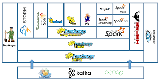
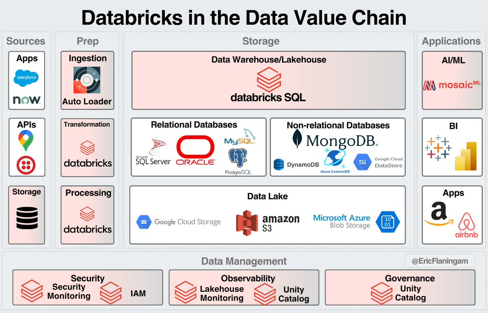
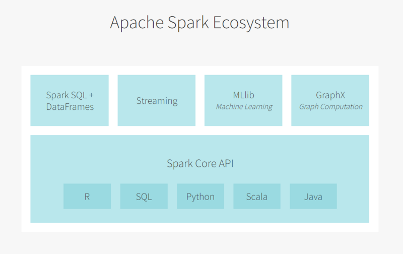
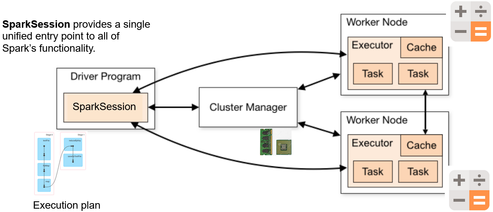
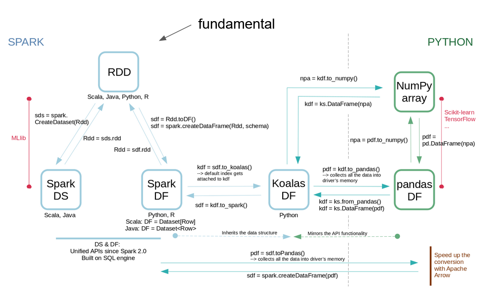
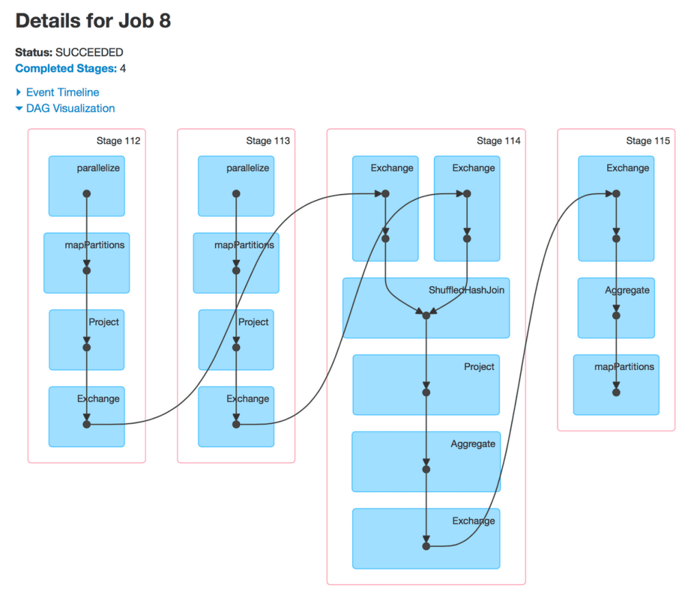
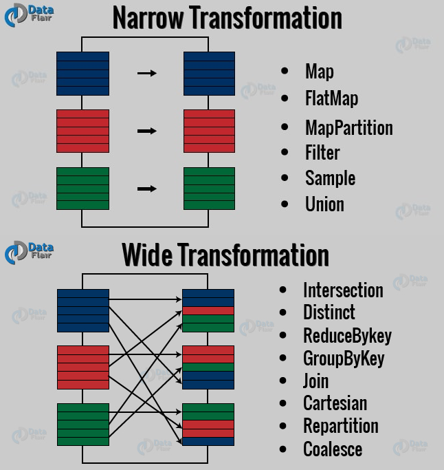

# Spark introduction

## Spark in Hadoop ecosystem



## Spark in Databricks ecosystem



## What is Apache Spark

- Fast (in-memory), distributed (parallel), general-purpose **cluster computing system**
- **Open Source** project [spark.apache.org](https://spark.apache.org/docs/latest/index.html) ([Apache Software Foundation](http://www.apache.org/))
- Strongly tied to the **Hadoop** ecosystem
- Written in **Scala** → runs in the JVM (Java Virtual Machine)
- Pick your language: **Scala, Python, R, SQL, Java**
- Sparks transforms your code into **tasks** to run on the **cluster nodes**
- Typically **10-100x faster** than Hadoop MapReduce on iterative workloads, mainly because intermediate results stay **in memory** instead of round-tripping to disk between stages

## Use cases

- Analyze / transform / apply ML models on:
  - Very **large datasets** (Extract, Transform and Load)
  - **Streaming** data (in near-real-time)
  - **Graphs** (network analysis)
- Structured (tables), semi-structured (JSON) or unstructured (text) data

## Spark ecosystem



- **Spark Core**: the base engine — scheduling, memory management, fault recovery, RDDs
- **Spark SQL**: DataFrames, SQL queries, Catalyst optimizer
- **Spark Streaming / Structured Streaming**: micro-batch and continuous processing
- **MLlib**: distributed machine learning algorithms and pipelines
- **GraphX / GraphFrames**: graph-parallel computation

## Internals

Spark connects to cluster managers that **distribute resources** (RAM, CPU) to applications, running on a cluster:

- Hadoop **YARN**
- Apache Mesos
- Kubernetes
- Spark standalone

When you write the code and submit it, Spark:

1. Asks for resources to **create driver + executors**
2. Transforms the **code** into **tasks**
3. **Driver** sends **tasks** to **executors**
4. **Executors** send **status** to **driver**



- The **driver** runs your `main()`, builds the DAG, and schedules work — it does **not** process data itself
- **Executors** are JVM processes on worker nodes that actually run tasks and cache data
- The **SparkContext** (or `SparkSession` in modern Spark) is the entry point the driver uses to talk to the cluster manager

## Data structures



| Structure     | Typed                                   | Optimized (Catalyst) | Best for                                             |
| ------------- | --------------------------------------- | -------------------- | ---------------------------------------------------- |
| **RDD**       | No (generic objects)                    | No                   | Low-level control, unstructured data                 |
| **DataFrame** | Runtime (schema, no compile-time types) | Yes                  | SQL-like structured/tabular data                     |
| **Dataset**   | Compile-time (Scala/Java only)          | Yes                  | Type-safe structured data (not available in PySpark) |

> In PySpark you mainly work with **DataFrames**; Datasets don't exist in Python since Python isn't statically typed.
> The RDD "Typed" column above is a PySpark view: in Scala/Java an RDD is generically typed at compile time
> (`RDD[Person]`). In PySpark an RDD just holds arbitrary Python objects, with nothing enforced.

## Operations

2 types of **operations**:

- **Transformations**:
  - transform a Spark DataFrame/RDD into a new DataFrame/RDD
  - examples: `orderBy()`, `groupBy()`, `filter()`, `select()`, `join()`
- **Actions**:
  - get the result
  - examples: `show()`, `take(10)`, `count()`, `collect()`, `save()`

**Lazy evaluation**: transformations triggered when action is called.

- Nothing runs until an action is called — Spark builds up a **logical plan** first
- Benefit: Spark can **optimize the whole chain** of transformations before executing anything (predicate pushdown, column pruning, combining filters, etc.)
- Common trap: calling `.collect()` on a huge DataFrame pulls **all** the data to the driver's memory → can crash the driver

## Resilient Distributed Datasets (RDDs)

### Properties

- A **fault-tolerant collection** of elements partitioned **across the nodes** of the cluster (parallelism)
- An element can be: string, array, dictionary, etc.
- An RDD is **immutable**
- Transformations are lambda expressions applied to each element (`map()`, `filter()`, ...). A subset — the
  **pair RDD** operations (`reduceByKey()`, `groupByKey()`, `join()`, ...) — work specifically on key-value tuples
- An RDD can be **persisted** in memory (`.cache()`) or across memory and disk (`.persist(storageLevel)`) for reuse,
  avoiding recomputing its lineage
- Mostly load data from **HDFS** (or Hadoop-like file system)
- RDDs are **partitioned**, with two different defaults depending on how they're created:
  - Reading from a file (`textFile()`): partitions follow the input's HDFS blocks (**1 partition ≈ 1 block**,
    128 MB by default)
  - Creating from an in-memory collection (`parallelize()`): partitions follow `spark.default.parallelism`,
    based on the number of CPU cores available
  - **1 task** runs on **1 partition**
- Fault tolerance comes from **lineage**: Spark remembers the chain of transformations, so a lost partition is just **recomputed**, not replicated

### API

Chain transformations and use the result with an action :

```Python
rdd = sc.wholeTextFiles('hdfs://text/file/path') \
    .map(lambda x: x.split(',')) \      #transformation
    .flatMap(...) \                     #transformation
    .groupByKey(...)                    #transformation
rdd.take(10)      # action
```

When an action is run:

- Spark builds a **Directed Acyclic Graph (DAG)** of stages
- 1 **stage** = X **tasks** (1 by RDD partition)
- Tasks are sent to **executors**
- The end of one stage is conditioned by a **shuffle**



### Narrow and wide transformations



- **Narrow** transformation: each input partition contributes to **at most one** output partition (e.g. `map()`, `filter()`) → no shuffle needed
- **Wide** transformation: input partitions contribute to **multiple** output partitions (e.g. `groupByKey()`, `join()`, `distinct()`) → requires a **shuffle** across the network, and marks a new **stage** boundary
- Shuffles are the main performance cost in Spark jobs — minimizing them is a key tuning goal

## Key takeaways

- Spark = distributed, in-memory, general-purpose engine — not just "faster Hadoop"
- Transformations are **lazy**; actions trigger execution and let Catalyst optimize the whole plan first
- Prefer the **DataFrame API** over raw RDDs for structured data
- In PySpark, stay in built-in functions and DataFrame operations as much as possible — that's where you get JVM-level performance from Python

---

_The content of this document, including all text, images, and associated materials, is the exclusive property of Adaltas and is protected by applicable copyright laws. Unauthorized distribution, reproduction, or sharing of this content, in whole or in part, is strictly prohibited without the express written consent of the author(s). Any violation of this restriction may result in legal action and the imposition of penalties as prescribed by law._
