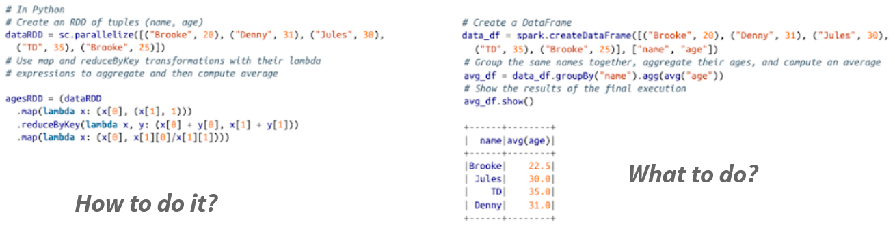
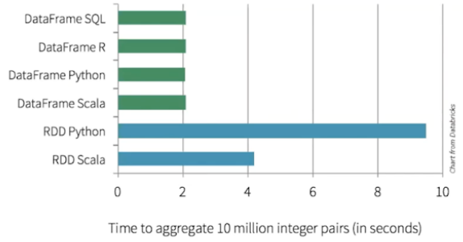
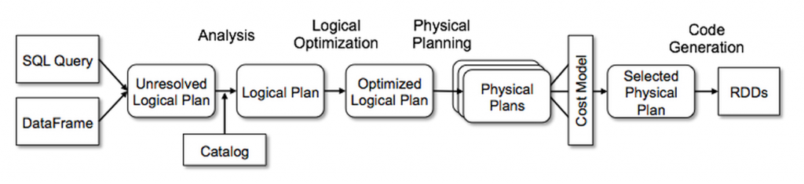

# SparkSQL & DataFrames

## RDDs: Pros and Cons

- Pros
  - Developers: **low level control** of execution
  - Works over **any** data type, no schema required — arbitrary objects, unstructured data
  - Fine-grained control over partitioning and custom fault-tolerant pipelines

- Cons
  - For user
    - **complicated** to express complex ideas
    - **difficult** to understand the code
    - more code needed for common operations (joins, aggregations, deduplication)

  - For Spark: lambda functions are **opaque** (no optimization), and there's no schema to check types or prune
    columns against

## DataFrames

- Structured dataset:
  - In-memory, distributed tables
  - Named and typed columns: schema
  - Collection of **Rows**
- Sources available: structured files (CSV, JSON, Parquet, Iceberg tables), Hive tables, RDBMS (MySQL, PostgreSQL, …), RDDs
- High-level APIs

## RDDs vs DataFrames

### Code



The classic side-by-side is a word count or a `groupBy` + aggregate: a few lines of DataFrame/SQL against a much
longer RDD version using `map()`, `flatMap()` and `reduceByKey()` by hand. The DataFrame version isn't just shorter —
it also states the _what_ (group by this, sum that) and leaves the _how_ to Catalyst, whereas the RDD version is a
literal sequence of steps Spark has no room to rewrite.

### Performance



The usual benchmark shape: Python RDDs are the slowest by far (every `map()` lambda pays the Py4J
serialization cost from the [PySpark](#pyspark) section). Scala RDDs are faster since they stay in
the JVM. DataFrame/SQL is faster still — in **either** language — because Catalyst compiles it to
optimized JVM bytecode. In the diagram: ~2s for DataFrame vs. ~4s for Scala RDD, so DataFrame beats
Scala RDD by about 2x. This is why DataFrame closes the Python/Scala gap completely: the language
you write it in stops mattering.

### Catalyst optimizer



Catalyst turns a DataFrame/SQL query into an execution plan in four phases:

1. **Analysis**: resolve column and table names against the schema/catalog
2. **Logical optimization**: rewrite the plan with rule-based passes — predicate pushdown, constant folding, column pruning
3. **Physical planning**: pick concrete execution strategies (e.g. broadcast join vs. shuffle join) and cost them
4. **Code generation**: compile the chosen plan to JVM bytecode

None of this runs on an RDD: a `map()` lambda is an opaque Python function Spark cannot look inside, so there is
nothing for Catalyst to analyze or rewrite.

## Working with DataFrames

Using **chaining** functions

```python
df
  .select(...)
  .filter(...)
```

Writing **SQL strings**

```python
spark.sql("SELECT * FROM table")
```

The two are not two separate worlds: `df.createOrReplaceTempView("table")` registers a DataFrame under a name so it
can be queried with `spark.sql(...)`, and a `spark.sql(...)` result is itself a DataFrame you can go on chaining.
Both compile to the same Catalyst plan.

## Why SQL?

- Around since the 70s
- Huge enterprise usage:
  - Lots of users
  - Lots of projects
- But: the SQL query language itself can't express iterative algorithms — ML training, graph traversal. This is a
  limit of **SQL as a language**, not of the DataFrame it produces: MLlib and GraphFrames are themselves built on top
  of the DataFrame API

## Schema Management in Spark

A DataFrame's schema is its column names, types, and nullability, Spark needs it before it can plan any query, so every read must produce one, either guessed or declared.

- `inferSchema`
- explicit schema

### `inferSchema=True`

Spark scans the file first to guess each column's type, then reads it again to actually load it.

```python
df = spark.read.csv("orders.csv", header=True, inferSchema=True)
df.printSchema()
```

- Convenient: no schema to write by hand
- Costs a full extra pass over the file — proportional to file size, paid on every run
- Unstable: types depend on whatever values are in the file right now. One unexpected row (an empty cell in a numeric column, a stray `"N/A"`) can silently widen a column's type — the job keeps running, just with a different, unannounced schema than last time
- For large files where the schema isn't known yet (EDA), sample instead of scanning everything:

```python
  spark.read.csv("large.csv", header=True, inferSchema=True, samplingRatio=0.01)
```

### Explicit schema with `StructType`

Declare the schema up front; Spark reads the file once, against that contract.

```python
from pyspark.sql.types import StructType, StructField, StringType, IntegerType, TimestampType

schema = StructType([
    StructField("order_id", StringType(), nullable=False),
    StructField("user_id", StringType(), nullable=False),
    StructField("ordered_at", TimestampType(), nullable=True),
    StructField("quantity", IntegerType(), nullable=True),
])

df = spark.read.csv("orders.csv", header=True, schema=schema)
```

- No extra pass — Spark parses directly against the declared types
- Fails fast and loud by default: a value Spark can't cast to the declared type becomes `null` rather than crashing — use `.option("mode", "FAILFAST")` if you want the read to error instead
- Enforces a contract: if upstream data changes shape (a column renamed, a type changed), you find out immediately instead of the schema quietly drifting
- Requires maintaining the schema definition alongside the data — more upfront work, but that work is a one-time cost, not a per-run cost

### Which to use

|           | `inferSchema=True`                         | Explicit `StructType`                    |
| --------- | ------------------------------------------ | ---------------------------------------- |
| Cost      | Full file scan, every run                  | None — direct parse                      |
| Stability | Can drift silently                         | Fixed, fails fast on mismatch            |
| Best for  | One-off EDA (ideally with `samplingRatio`) | Production jobs, anything run repeatedly |

Rule of thumb: if you're going to run this read more than once, or someone else depends on its output, the schema should be explicit. `inferSchema` is an exploration tool, not a production setting.

## PySpark

**PySpark** is the Python API for Spark. It exposes the same core engine (Spark Core, Spark SQL, Structured Streaming, MLlib) to Python programs.

### How it works under the hood

- Spark itself runs on the **JVM**; PySpark uses **Py4J** to let Python code call into the JVM driver
- Your Python driver process talks to the JVM driver, which schedules work on executors (also JVM processes)
- For DataFrame code, Python mostly just **builds the query plan** — the actual execution happens in the JVM, so performance is close to Scala/Java
- For **UDFs** (user-defined functions) and RDD `.map()` with Python lambdas, data has to be **serialized and sent to a separate Python worker process** per executor → real performance cost. Prefer built-in `pyspark.sql.functions` over Python UDFs whenever possible.

```python
from pyspark.sql import SparkSession

spark = (
    SparkSession.builder
    .appName("SalesAnalysis")
    .master("local[*]")
    .getOrCreate()
)

df = spark.read.parquet("data/sales")
df.groupBy("region").sum("revenue").show()
```

## PySpark essentials

```python
from pyspark.sql import functions as F

df.select("name", "age")
df.filter(F.col("age") > 30)
df.withColumn("bonus", F.col("salary") * 0.1)
df.groupBy("dept").agg(F.avg("salary").alias("avg_salary"))
df.join(other_df, on="id", how="left")
df.write.mode("overwrite").parquet("out/clean_sales")
```

- `pyspark.sql.functions` (as `F`) covers most transformations without ever writing a UDF
- When a UDF is unavoidable, prefer a **Pandas UDF** (`@pandas_udf`, vectorized via Apache Arrow) over a plain row-by-row UDF

## Running and tuning a PySpark job

```bash
spark-submit --master yarn --deploy-mode cluster \
  --num-executors 10 --executor-memory 4g --executor-cores 2 \
  my_job.py
```

This is the general, cluster form. The labs run with `.master("local[*]")` instead, where driver and executors share
one JVM on a single machine — so `--num-executors`, `--executor-memory` and `--executor-cores` don't apply there;
`local[*]` only controls how many threads act as executors.

- Avoid `.collect()` on large results — use `.show(n)`, `.take(n)`, or write to storage
- `df.cache()` / `df.persist()` when a DataFrame is reused multiple times
- `broadcast(small_df)` to avoid shuffling a large table when joining against a small one
- `repartition(n)` (full shuffle) vs `coalesce(n)` (cheap, reduces partitions only)
- The **Spark UI** (port 4040 by default) shows stages, tasks, shuffle sizes, and skew — the first place to look when a job is slow

---

_The content of this document, including all text, images, and associated materials, is the exclusive property of Adaltas and is protected by applicable copyright laws. Unauthorized distribution, reproduction, or sharing of this content, in whole or in part, is strictly prohibited without the express written consent of the author(s). Any violation of this restriction may result in legal action and the imposition of penalties as prescribed by law._
